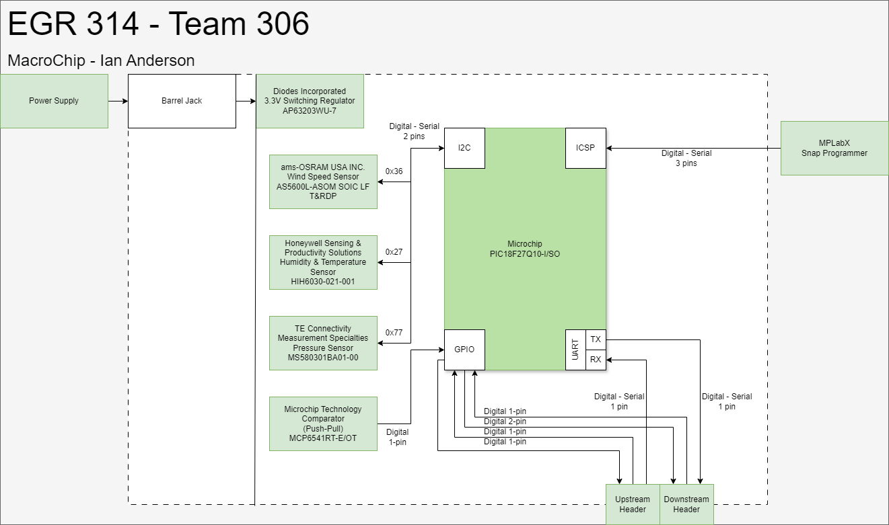

## Sensor Suite Subsystem

The above block diagram was first utilized to identify key components for peripheral functionality. It then provided a host to consolidate key information about subsystem components. It also allows for a comprehensive look at the subsystem to verify that necessary requirements are met such as serial sensors and UART daisy chain headers.
