## Required & Selected Components

Microcontroller     - PIC18F47Q10-I/PT  
Volatage Regulator  - AP63203WU-7  
Hall Effect Sensor  - IQS620A-0-DNR  
Temperature Sensor  - HDC3020DEFR  
Humidity Sensor     - HDC3020DEFR  
Air Pressure Sensor - LPS22HBTR

### Microcontroller

Option |  Pros | Cons
---|---|---
 [PIC18F47Q10-I/PT](https://www.digikey.com/en/products/detail/microchip-technology/PIC18F47Q10-I-PT/10187786)   $1.65/each [datasheet](https://ww1.microchip.com/downloads/en/DeviceDoc/PIC18F27-47Q10-Data-Sheet-40002043E.pdf) | - Familiar due to use in course  - 128kB Memory  - 36 IO pins  - Fast 64MHz processing  - Inexpensive | - Low power range  - Could be limiting with amount of peripherals
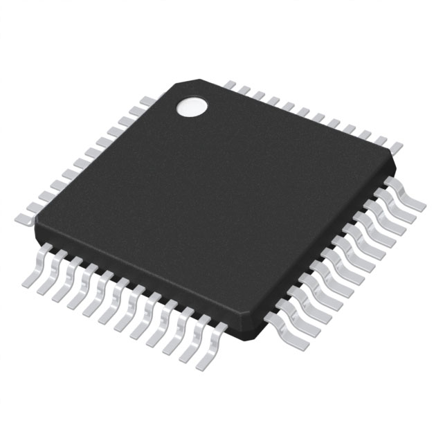 [PIC24FJ256GA705-I/PT](https://www.digikey.com/en/products/detail/microchip-technology/PIC24FJ256GA705-I-PT/6565015)   $2.13/each [datasheet](https://ww1.microchip.com/downloads/en/DeviceDoc/PIC24FJ256GA705-Family-Data-Sheet-DS30010118E.pdf) | - Supports 16-bit  - 256kB Memory  - 40 IO pins | - Unfamiliar product family  - Unnecessary for requirements  - Small operational voltage range
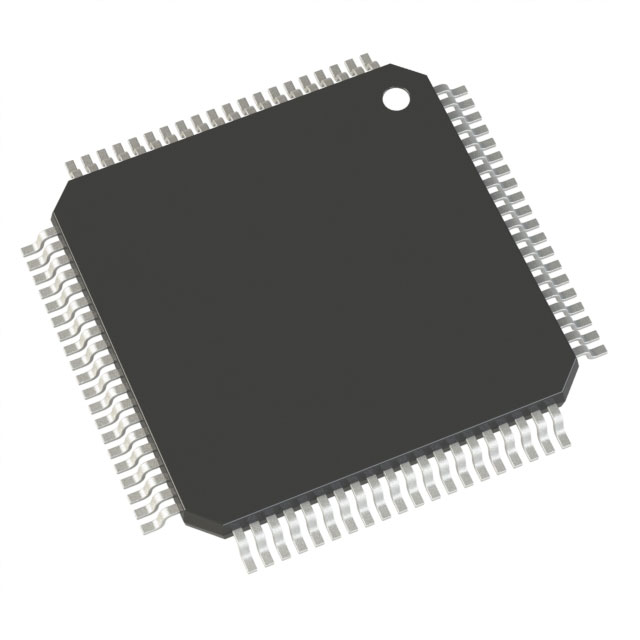 [PIC18LF8723-I/PT](https://www.digikey.com/en/products/detail/microchip-technology/PIC18LF8723-I-PT/1681042)   $16.85/each [datasheet](https://ww1.microchip.com/downloads/en/DeviceDoc/39894b.pdf) | - 128kB Memory  - 70 IO pins  - Allows for more redundant wiring | - Excessive connection points  - Expensive  - Overkill for requirements

Selected Component: Option 1 - PIC18F47Q10-I/PT  
Rational: This option satisfies the requirements for my team's microcontroller. It is also the easiest to work with as it is used compiously within our course and is familiar. This option also uses very little of the budget and allows for funds to be allocated elsewhere.

### Voltage Regulator

Option | Pros | Cons
---|---|---
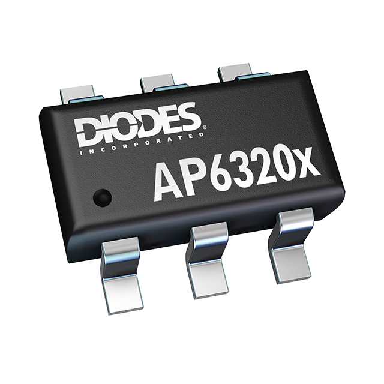 [AP63203WU-7](https://www.digikey.com/en/products/detail/diodes-incorporated/AP63203WU-7/9858426) $1.38/each [datasheet](https://www.diodes.com/assets/Datasheets/AP63200-AP63201-AP63203-AP63205.pdf) | - Large input voltage range  - 2A output capacity  - Simple application circuitry | - Smaller operational temperature range  - Small package
 [TPS62132RGTR](https://www.digikey.com/en/products/detail/texas-instruments/TPS62132RGTR/2786726) $1.71/each [datasheet](https://www.ti.com/lit/ds/symlink/tps62130.pdf?HQS=dis-dk-null-digikeymode-dsf-pf-null-wwe&ts=1738923213197) | - 3A output capacity  - High switching speed  - Lowest minimum input voltage | - Smaller input voltage range  - Difficult solder pads  - Complicated application circuitry
 [LM2675MX-3.3/NOPB](https://www.digikey.com/en/products/detail/texas-instruments/LM2675MX-3-3-NOPB/366907) $4.36/each [datasheet](https://www.ti.com/lit/ds/symlink/lm2675.pdf?HQS=dis-dk-null-digikeymode-dsf-pf-null-wwe&ts=1738976377161&ref_url=https%253A%252F%252Fwww.ti.com%252Fgeneral%252Fdocs%252Fsuppproductinfo.tsp%253FdistId%253D10%2526gotoUrl%253Dhttps%253A%252F%252Fwww.ti.com%252Flit%252Fgpn%252Flm2675) | - Large input voltage range  - High maximum input voltage  - Larger operational temperature range | - Limited 1A output capacity  - Higher minimum input voltage  - Lower switching frequency  - Expensive

Selected Component: Option 1 - AP63203WU-7  
Rational: This switching power supply has the desired output of 3.3 volts and has a decent current capacity. It is also in a package that is easily soldered by hand. The higher switching frequency makes it better suited to the lower input voltages.

### Hall Effect Sensor (Wind Speed)

Option | Pros | Cons
---|---|---
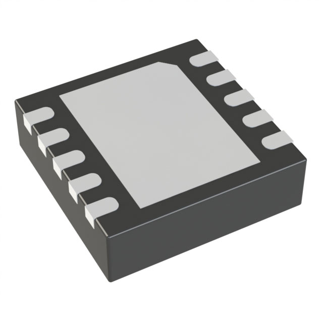 [IQS620A-0-DNR](https://www.digikey.com/en/products/detail/azoteq-pty-ltd/IQS620A-0-DNR/8259215) $0.76/each [datasheet](https://www.azoteq.com/images/stories/pdf/iqs620_datasheet.pdf) | - Inexpensive  - I2C data interface  - Flexible application | - Low operational voltage range  - Higher current draw
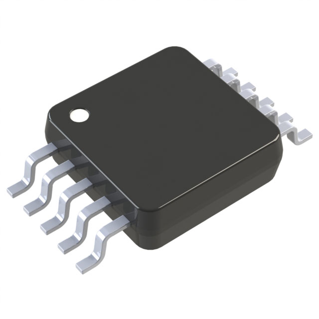 [MAX9621AUB+](https://www.digikey.com/en/products/detail/analog-devices-inc-maxim-integrated/MAX9621AUB/2239092) $3.65/each [datasheet](https://www.analog.com/media/en/technical-documentation/data-sheets/MAX9621.pdf) | - Lower current draw  - Large operational voltage range | - Complicated application  - Expensive
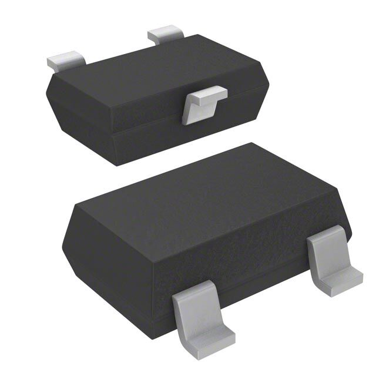 [A1304ELHLX-T](https://www.digikey.com/en/products/detail/allegro-microsystems/A1304ELHLX-T/4552949?gclsrc=aw.ds&&utm_adgroup=&utm_source=google&utm_medium=cpc&utm_campaign=PMax%20Shopping_Product_High%20ROAS%20Categories&utm_term=&utm_content=&utm_id=go_cmp-20222717502_adg-_ad-__dev-c_ext-_prd-4552949_sig-Cj0KCQiA-5a9BhCBARIsACwMkJ7cF_KgTJqyZMYP8CbcNho2u9uOeVeN2OHf7pAXgWwaTmbPvqIEFq4aAnqREALw_wcB&gad_source=1&gclid=Cj0KCQiA-5a9BhCBARIsACwMkJ7cF_KgTJqyZMYP8CbcNho2u9uOeVeN2OHf7pAXgWwaTmbPvqIEFq4aAnqREALw_wcB) $0.96/each [datasheet](https://www.allegromicro.com/~/media/Files/Datasheets/A1304-Datasheet.ashx) | - Simple analog output  - Inexpensive  - Easy implementation | - Cannot satisfy serial sensor requirement  - Narrow operational voltage range  - Higher current draw

Selected Component: Option 1 - IQS620A-0-DNR  
Rational: This option is simple to implement, and while it has the highest current draw, its I2C communication support doesn't require additional components as an analog sensor would.

### Temperature Sensor

Option | Pros | Cons
---|---|---
 [TC74A4-3.3VCTTR](https://www.digikey.com/en/products/detail/microchip-technology/TC74A4-3-3VCTTR/443268) $1.15/each [datasheet](https://ww1.microchip.com/downloads/en/DeviceDoc/21462D.pdf) | - Wide operational voltage range  - I2C data interface | - Lower resolution  - More expensive
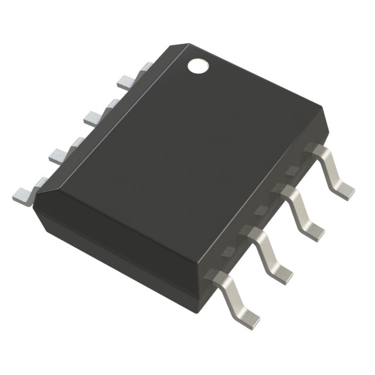 [LM75AD,118](https://www.digikey.com/en/products/detail/nxp-usa-inc/LM75AD-118/1692795) $0.66/each [datasheet](https://www.nxp.com/docs/en/data-sheet/LM75A.pdf) | - I2C data interface  - Higher resolution  - Programmable limit  - Inexpensive | - Larger component  - Unnecessary extra features
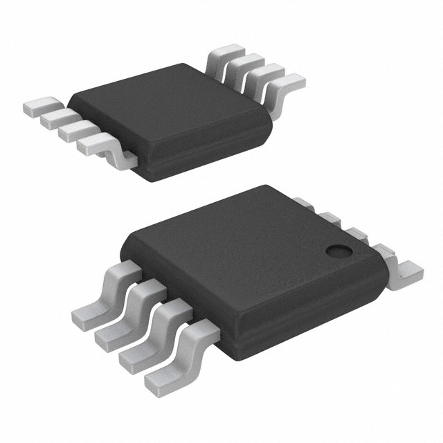 [LM75BDP,118](https://www.digikey.com/en/products/detail/nxp-usa-inc/LM75BDP-118/2075977) $0.61/each [datasheet](https://www.nxp.com/docs/en/data-sheet/LM75B.pdf) | - I2C data interface  - Higher resolution  - Programable limit  - Inexpensive | - Larger component

Selected Component: Other - HDC3020DEFR  
Rational: The selected component for the humidity sensor doubles as a temperature sensor. This eliminates the need for a standalone sensor.

### Humidity Sensor

Option | Pros | Cons
---|---|---
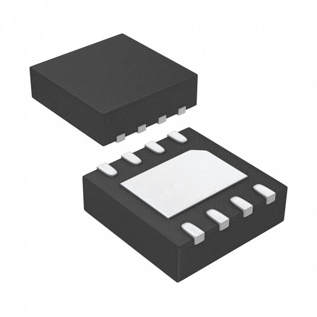 [HDC3020DEFR](https://www.digikey.com/en/products/detail/texas-instruments/HDC3020DEFR/17884961) $2.55/each [datasheet](https://www.ti.com/lit/ds/symlink/hdc3020.pdf) | - Includes temperature sensor  - 0.5% Accuracy  - I2C data interface  - 4s response time | - Expensive  - Difficult package to solder
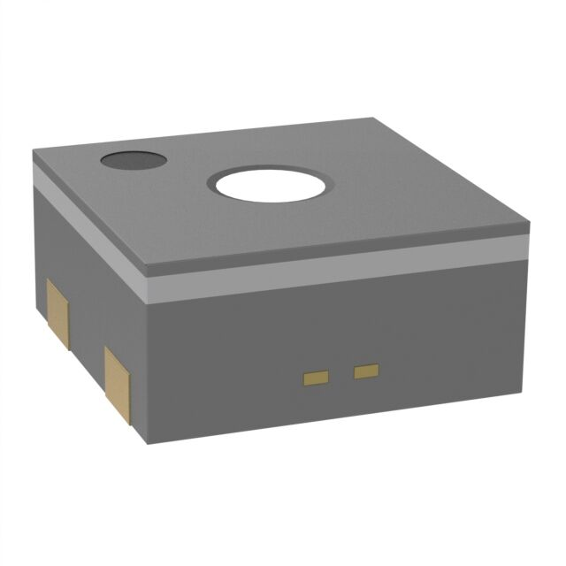 [SHT40-AD1B-R3](https://www.digikey.com/en/products/detail/sensirion-ag/SHT40-AD1B-R3/14322709) $1.81/each [datasheet](https://sensirion.com/media/documents/33FD6951/662A593A/HT_DS_Datasheet_SHT4x.pdf) | - 1.8% Accuracy  - I2C data interface  - 4s response time | - Narrow operational voltage range
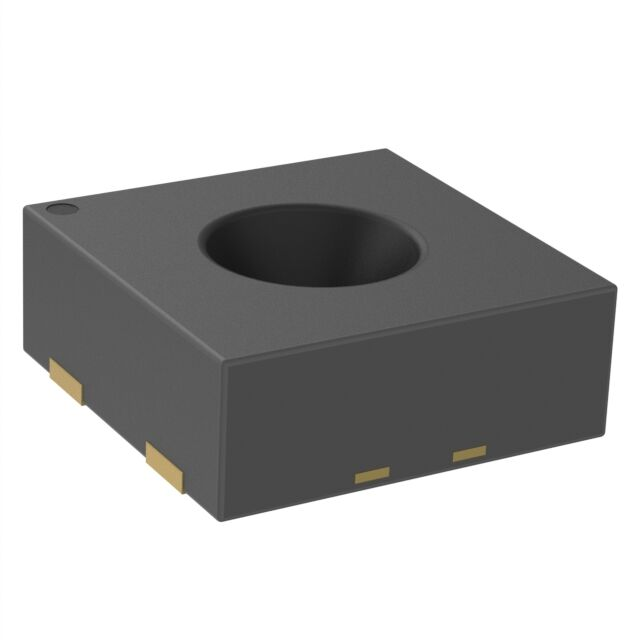 [SHTC3-TR-10KS](https://www.digikey.com/en/products/detail/sensirion-ag/SHTC3-TR-10KS/9477851) $2.06/each [datasheet](https://mm.digikey.com/Volume0/opasdata/d220001/medias/docus/906/HT_DS_SHTC3_D1.pdf) | - 2% Accuracy  - I2C data interface | - Narrow operational voltage range  - 8s response time

Selected Component: Option 1 - HDC3020DEFR  
Rational: This option boasts the best accuracy whilst using I2C for data communication. It also has a fast response time. This option also has a temperature sensor included so less components are required.

### Air Pressure Sensor

Option | Pros | Cons
---|---|---
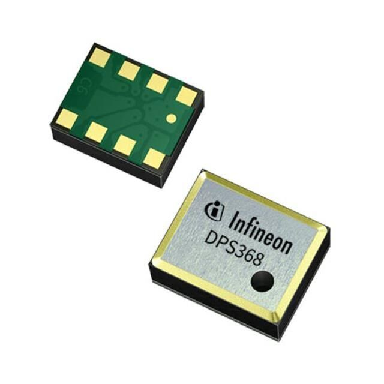 [DPS368XTSA1](https://www.digikey.com/en/products/detail/infineon-technologies/DPS368XTSA1/10244079) $2.51/each [datasheet](https://www.infineon.com/dgdl/Infineon-DPS368-DS-v01_00-EN.pdf?fileId=5546d46269e1c019016a0c45105d4b40) | - Supports I2C & SPI communication  - Simpler footprint | - Vented guage   - Smaller pressure range  - Difficult soldering points
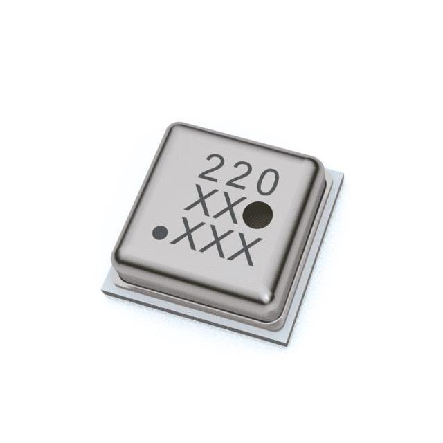 [ENS220S-BLGT](https://www.digikey.com/en/products/detail/sciosense/ENS220S-BLGT/21278457) $2.70/each [datasheet](https://www.sciosense.com/wp-content/uploads/2023/12/ENS220-Datasheet.pdf) | - Adequate pressure range  - Supports I2C & SPI communication  - Absolute pressure guage | - Very low operational voltage range  - Less suited for application  - Difficult soldering points
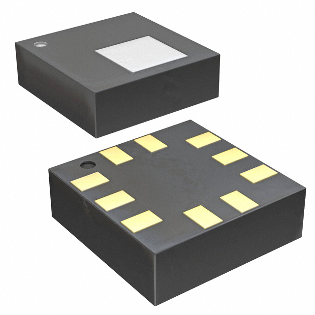 [LPS22HBTR](https://www.digikey.com/en/products/detail/stmicroelectronics/LPS22HBTR/5799910) $2.81/each [datasheet](https://www.st.com/content/ccc/resource/technical/document/datasheet/bf/c1/4f/23/61/17/44/8a/DM00140895.pdf/files/DM00140895.pdf/jcr:content/translations/en.DM00140895.pdf) | - Adequate pressure range  - Supports I2C & SPI communication  - Absolute pressure guage | - Difficult soldering points

Selected Component: Option 3 - LPS22HBTR  
Rational: This sensor is an absolute pressure sensor that can operate with the 3.3V utilized in the subsystem. It also uses I2C to communicate data which is the chosen method for the subsystem.
