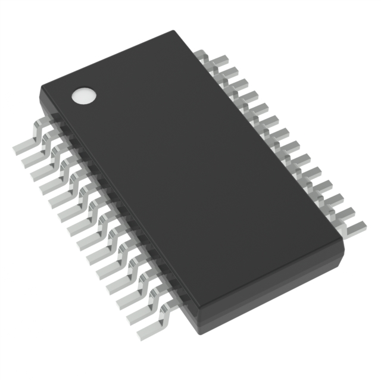

## Required & Selected Components

- Microcontroller
  - PIC18F47Q10-I/PT
- Volatage Regulator
  - *part*
- Hall Effect Sensor
  - *part*
- Temperature Sensor
  - *part*
- Humidity Sensor
  - *part*
- Air Pressure Sensor
  - *part*
- Solar Tracker Sensor
  - *part*

### Microcontroller

Option |  Pros | Cons
---|---|---
  [PIC18F47Q10-I/PT](https://www.digikey.com/en/products/detail/microchip-technology/PIC18F47Q10-I-PT/10187786)   $1.65/each [datasheet](https://ww1.microchip.com/downloads/en/DeviceDoc/PIC18F27-47Q10-Data-Sheet-40002043E.pdf) | - Familiar  - 128kB Memory  - Inexpensive | - Low power range  - Decent but not extraordinary specs
  [PIC24FJ256GA705-I/PT](https://www.digikey.com/en/products/detail/microchip-technology/PIC24FJ256GA705-I-PT/6565015)   $2.13/each [datasheet](https://ww1.microchip.com/downloads/en/DeviceDoc/PIC24FJ256GA705-Family-Data-Sheet-DS30010118E.pdf) | - Supports 16-bit | - Unfamiliar  - Unnecessary for requirements
  [PIC18LF8723-I/PT](https://www.digikey.com/en/products/detail/microchip-technology/PIC18LF8723-I-PT/1681042)   $16.85/each [datasheet](https://ww1.microchip.com/downloads/en/DeviceDoc/39894b.pdf) | - copious io pins  -allows for more redundant wiring | - excessive  - expensive  - overkill for requirements

Selected Component: Option 1 - PIC18F47Q10-I/PT  
Rational: This microcontroller satisfies my group's needs for microcontroller capabilities for our project. Keeping all used microcontrollers the same aids to allow for easy integration.

### Voltage Regulator

Option | Pros | Cons
---|---|---

Selected Component:  
Rational:

### Hall Effect Sensor (Wind Speed)

Option | Pros | Cons
---|---|---

Selected Component:  
Rational:

### Temperature Sensor

Option | Pros | Cons
---|---|---

Selected Component:  
Rational:

### Humidity Sensor

Option | Pros | Cons
---|---|---

Selected Component:  
Rational:

### Air Pressure Sensor

Option | Pros | Cons
---|---|---

Selected Component:  
Rational:

### Solar Tracker Sensor

Option | Pros | Cons
---|---|---

Selected Component:  
Rational:
