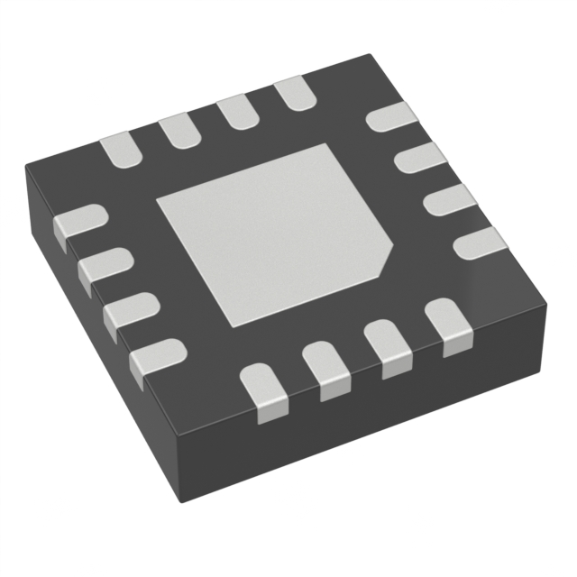
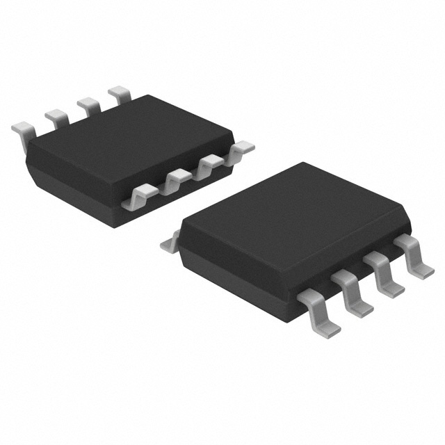
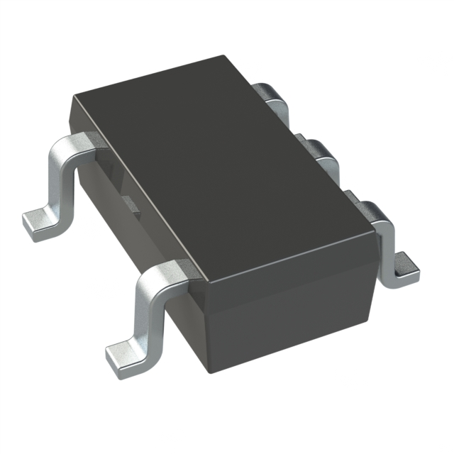
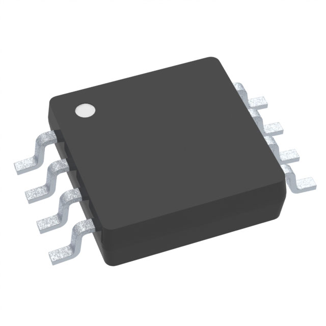

## Required & Selected Components

Component Name      | Selection
--------------------|-----------------
Microcontroller     | PIC18F47Q10-I/PT  
Volatage Regulator  | AP63203WU-7  
Hall Effect Sensor  | AS5600L-ASOM SOIC LF T&RDP  
Temperature Sensor  | HIH6030-021-001  
Humidity Sensor     | HIH6030-021-001  
Air Pressure Sensor | LPS22HBTR
Comparator          | MCP6541RT-E/OT

### Microcontroller

Option |  Pros | Cons
---|---|---
 [PIC18F47Q10-I/PT](https://www.digikey.com/en/products/detail/microchip-technology/PIC18F47Q10-I-PT/10187786)   $1.65/each [datasheet](https://ww1.microchip.com/downloads/en/DeviceDoc/PIC18F27-47Q10-Data-Sheet-40002043E.pdf) | - Familiar due to use in course  - 128kB Memory  - 36 IO pins  - Fast 64MHz processing  - Inexpensive | - Low power range  - Could be limiting with amount of peripherals
 [PIC24FJ256GA705-I/PT](https://www.digikey.com/en/products/detail/microchip-technology/PIC24FJ256GA705-I-PT/6565015)   $2.13/each [datasheet](https://ww1.microchip.com/downloads/en/DeviceDoc/PIC24FJ256GA705-Family-Data-Sheet-DS30010118E.pdf) | - Supports 16-bit  - 256kB Memory  - 40 IO pins | - Unfamiliar product family  - Unnecessary for requirements  - Small operational voltage range
 [PIC18LF8723-I/PT](https://www.digikey.com/en/products/detail/microchip-technology/PIC18LF8723-I-PT/1681042)   $16.85/each [datasheet](https://ww1.microchip.com/downloads/en/DeviceDoc/39894b.pdf) | - 128kB Memory  - 70 IO pins  - Allows for more redundant wiring | - Excessive connection points  - Expensive  - Overkill for requirements

Selected Component: Option 1 - PIC18F47Q10-I/PT  
Rational: This option satisfies the requirements for my team's microcontroller. It is also the easiest to work with as it is used compiously within our course and is familiar. This option also uses very little of the budget and allows for funds to be allocated elsewhere.

### Voltage Regulator

Option | Pros | Cons
---|---|---
 [AP63203WU-7](https://www.digikey.com/en/products/detail/diodes-incorporated/AP63203WU-7/9858426) $1.38/each [datasheet](https://www.diodes.com/assets/Datasheets/AP63200-AP63201-AP63203-AP63205.pdf) | - Large input voltage range  - 2A output capacity  - Simple application circuitry  - Reduced electromagnetic interference | - Smaller operational temperature range  - Small package
 [TPS62132RGTR](https://www.digikey.com/en/products/detail/texas-instruments/TPS62132RGTR/2786726) $1.71/each [datasheet](https://www.ti.com/lit/ds/symlink/tps62130.pdf?HQS=dis-dk-null-digikeymode-dsf-pf-null-wwe&ts=1738923213197) | - 3A output capacity  - High switching speed  - Lowest minimum input voltage  - Provides short circuit protection | - Smaller input voltage range  - Difficult solder pads  - Complicated application circuitry
 [LM2675MX-3.3/NOPB](https://www.digikey.com/en/products/detail/texas-instruments/LM2675MX-3-3-NOPB/366907) $4.36/each [datasheet](https://www.ti.com/lit/ds/symlink/lm2675.pdf?HQS=dis-dk-null-digikeymode-dsf-pf-null-wwe&ts=1738976377161&ref_url=https%253A%252F%252Fwww.ti.com%252Fgeneral%252Fdocs%252Fsuppproductinfo.tsp%253FdistId%253D10%2526gotoUrl%253Dhttps%253A%252F%252Fwww.ti.com%252Flit%252Fgpn%252Flm2675) | - Large input voltage range  - High maximum input voltage  - Larger operational temperature range  - Has variable output version | - Limited 1A output capacity  - Higher minimum input voltage  - Lower switching frequency  - Expensive

Selected Component: Option 1 - AP63203WU-7  
Rational: This switching power supply has the desired output of 3.3 volts and has an adequate current capacity. It is also in a package that is easily soldered by hand. The required supporting circuitry is simple and will take up less space. The higher switching frequency makes it better suited to the lower input voltages.

### Hall Effect Sensor (Wind Speed)

Option | Pros | Cons
---|---|---
 [HAL3726DJ-A](https://www.digikey.com/en/products/detail/tdk-micronas-gmbh/HAL3726DJ-A/5271756) $2.70/each [datasheet](https://www.digikey.com/en/products/detail/tdk-micronas-gmbh/HAL3726DJ-A/5271756) | - Provides self diagnosis  - Rotary hall effect sensor  - Can read 2D position | - Requires separate voltage regulator(doesn't operate at 3.3V)  - More expensive option  - No serial communication
 [A1304ELHLX-T](https://www.digikey.com/en/products/detail/allegro-microsystems/A1304ELHLX-T/4552949?gclsrc=aw.ds&&utm_adgroup=&utm_source=google&utm_medium=cpc&utm_campaign=PMax%20Shopping_Product_High%20ROAS%20Categories&utm_term=&utm_content=&utm_id=go_cmp-20222717502_adg-_ad-__dev-c_ext-_prd-4552949_sig-Cj0KCQiA-5a9BhCBARIsACwMkJ7cF_KgTJqyZMYP8CbcNho2u9uOeVeN2OHf7pAXgWwaTmbPvqIEFq4aAnqREALw_wcB&gad_source=1&gclid=Cj0KCQiA-5a9BhCBARIsACwMkJ7cF_KgTJqyZMYP8CbcNho2u9uOeVeN2OHf7pAXgWwaTmbPvqIEFq4aAnqREALw_wcB) $0.96/each [datasheet](https://www.allegromicro.com/~/media/Files/Datasheets/A1304-Datasheet.ashx) | - Simple analog output  - Inexpensive  - Easy implementation | - Linear hall effect sensor  - No serial communication  - Narrow operational voltage range  - Higher current draw
 [AS5600L-ASOM SOIC LF T&RDP](https://www.digikey.com/en/products/detail/ams-osram-usa-inc/AS5600L-ASOM-SOIC8-LF-T-RDP/10324317) $4.54/each [datasheet](https://www.digikey.com/htmldatasheets/production/1647438/0/0/1/as5600-datasheet.pdf) | - I2C data communication  - Rotary hall effect sensor  - Operates at 3.3v | - Most expensive option  - Sensitive to moisture  - Limited reprogramming

Selected Component: Option 3 - AS5600L-ASOM SOIC LF T&RDP  
Rational: This option provides an I2C compatible rotary hall effect sensor. The rotary design allows for the easiest implementation of sensor. It is the most expensive option, but comes with the most ideal features.

### Temperature Sensor

Option | Pros | Cons
---|---|---
 [TC74A4-3.3VCTTR](https://www.digikey.com/en/products/detail/microchip-technology/TC74A4-3-3VCTTR/443268) $1.15/each [datasheet](https://ww1.microchip.com/downloads/en/DeviceDoc/21462D.pdf) | - Wide operational voltage range  - I2C data interface  - Returns raw temperature(doesn't require further calculations)  - Multiple versions with different addresses | - Lower resolution(7b)  - More expensive  - Negative temperatures require further calculations  - Slower I2C clock limit
 [LM75AD,118](https://www.digikey.com/en/products/detail/nxp-usa-inc/LM75AD-118/1692795) $0.66/each [datasheet](https://www.nxp.com/docs/en/data-sheet/LM75A.pdf) | - I2C data interface  - Higher resolution(11b)  - Programmable limit  - Inexpensive | - Larger component  - Unnecessary extra features  - Requires further data transformation  - Requires more connections
 [TMP1075DGKR](https://www.digikey.com/en/products/detail/texas-instruments/TMP1075DGKR/9692553) $0.47/each [datasheet](https://www.ti.com/lit/ds/symlink/tmp1075.pdf) | - I2C data interface  - Higher resolution(12b)  - Most inexpensive option | -More data to be communicated  - Requires further data transformation  - Requires more connections

Selected Component: Other - HIH6030-021-001  
Rational: The selected component for the humidity sensor doubles as a temperature sensor. This eliminates the need for a standalone sensor.

### Humidity Sensor

Option | Pros | Cons
---|---|---
 [HIH6030-021-001](https://www.digikey.com/en/products/detail/texas-instruments/HIH6030-021-001/17884961) $2.55/each [datasheet](https://www.ti.com/lit/ds/symlink/hdc3020.pdf) | - I2C data interface  - Has temperature output  - Most inexpensive option  - Highest accuracy | - Extremely difficult to solder  - Tiny chip size  - Lacks standard mode I2C speed
 [H6030-021-001](https://www.digikey.com/en/products/detail/honeywell-sensing-and-productivity-solutions/HIH6030-021-001/4291625) $6.67/each [datasheet](https://prod-edam.honeywell.com/content/dam/honeywell-edam/sps/siot/en-us/products/sensors/humidity-with-temperature-sensors/honeywell-humidicon-hih6000-series/documents/sps-siot-hih6000-datasheet-009073-7-en-ciid-147070.pdf) | - I2C data interface  - Has temperature output  - Affordable cost | - Lowest relative humidity accuracy  - Non-condensing
 [HIH6131-000-001](https://www.digikey.com/en/products/detail/honeywell-sensing-and-productivity-solutions/HIH6131-000-001/5253024) $18.09/each [datasheet](https://prod-edam.honeywell.com/content/dam/honeywell-edam/sps/siot/en-us/products/sensors/humidity-with-temperature-sensors/honeywell-humidicon-hih6100-series/documents/sps-siot-humidicon-hih6100-series-product-sheet-009059-6-en-ciid-142165.pdf) | - SPI data interface  - Has temperature output  - Protected from condensation | - Does not support I2C  - Very expensive option

Selected Component: Option 2 - HIH6030-021-001  
Rational: This option has the lowest accuracy; however, its larger package is easier to solder and supports I2C communication. It also doubles as a temperature sensor which offsets the increased cost.

### Air Pressure Sensor

Option | Pros | Cons
---|---|---
 [DPS368XTSA1](https://www.digikey.com/en/products/detail/infineon-technologies/DPS368XTSA1/10244079) $2.51/each [datasheet](https://www.infineon.com/dgdl/Infineon-DPS368-DS-v01_00-EN.pdf?fileId=5546d46269e1c019016a0c45105d4b40) | - Supports I2C & SPI communication  - Simpler footprint  - Measures temperature | - Vented guage   - Smaller pressure range  - Difficult soldering points
 [ENS220S-BLGT](https://www.digikey.com/en/products/detail/sciosense/ENS220S-BLGT/21278457) $2.70/each [datasheet](https://www.sciosense.com/wp-content/uploads/2023/12/ENS220-Datasheet.pdf) | - Adequate pressure range  - Supports I2C & SPI communication  - Absolute pressure guage  - Measures temperature | - Very low operational voltage range  - Less suited for application  - Difficult soldering points
 [LPS22HBTR](https://www.digikey.com/en/products/detail/stmicroelectronics/LPS22HBTR/5799910) $2.81/each [datasheet](https://www.st.com/content/ccc/resource/technical/document/datasheet/bf/c1/4f/23/61/17/44/8a/DM00140895.pdf/files/DM00140895.pdf/jcr:content/translations/en.DM00140895.pdf) | - Adequate pressure range  - Supports I2C & SPI communication  - Absolute pressure guage | - Difficult soldering points  - Most expensive option  - Doesn't return temperature

Selected Component: Option 3 - LPS22HBTR  
Rational: This sensor is an absolute pressure sensor that can operate with the 3.3V utilized in the subsystem. It also uses I2C to communicate data which is the chosen method for the subsystem. This option also has a higher maximum pressure and is temperature compensated.

### Comparator

Option | Pros | Cons
---|---|---
 [LM2903DR](https://www.digikey.com/en/products/detail/texas-instruments/LM2903DR/276656) $0.18/each [datasheet](https://www.ti.com/lit/ds/symlink/lm193.pdf?ts=1640569642482) | - Power can be supplied rail-to-rail  - Very inexpensive  - Extremely fast operation  - Large differential voltage range | - Open collector design(harder to implement)  - Larger package  - More complex circuit & connections
 [MCP6541RT-E/OT](https://www.digikey.com/en/products/detail/microchip-technology/MCP6541RT-E-OT/870211) $0.39/each [datasheet](https://ww1.microchip.com/downloads/en/DeviceDoc/MCP6541%20Output%20SubMicroamp%20Comparators%2020001696K.pdf) | - Power can be supplied rail-to-rail  - Push-pull design  - Can drive larger load | - Slower operation speed  - Smallest voltage supply range
 [TLV7031QDBVRQ1](https://www.digikey.com/en/products/detail/texas-instruments/TLV7031QDBVRQ1/15222328) $0.72/each [datasheet](https://www.ti.com/lit/ds/symlink/tlv7031-q1.pdf) | - Power can be supplied rail-to-rail  - Push-pull design  - Decent voltage supply range | - Limited differential voltage  - Higher hysteresis  - Limited load driving capability

Selected Component: Option 2 - MCP6541RT-E/OT  
Rational: The push-pull configuration of this option allows for easy implementation. This option also has a lower hysteresis which gives a lower switching threshold for the application.
