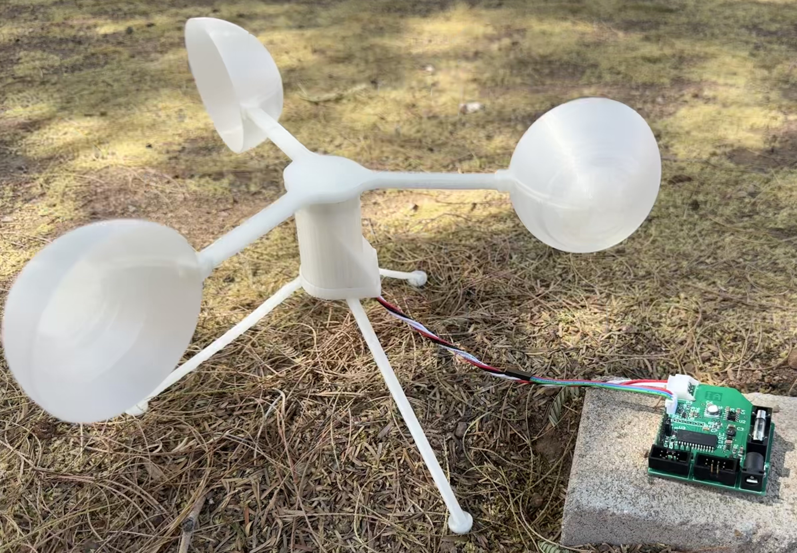

Ian Anderson

The sensor suite gathers environmental data via I2C sensors for user and positional data to align the device's solar panel. This data is transmitted over the UART daisy chain to the other subsystems.

[Block Diagram](./block.md)  
[Component Selection](./component.md)  
[Power Budget](./power.md)  
[Schematic & PCB](./schematic.md)  
[Bill of Materials](./bom.md)  
[API](./api.md)  
[Resources](./resources.md)

[Team Report](https://egr314-2025-s-306.github.io/EGR314-Team306/)

## EGR 314 - Team 306 - S2025
