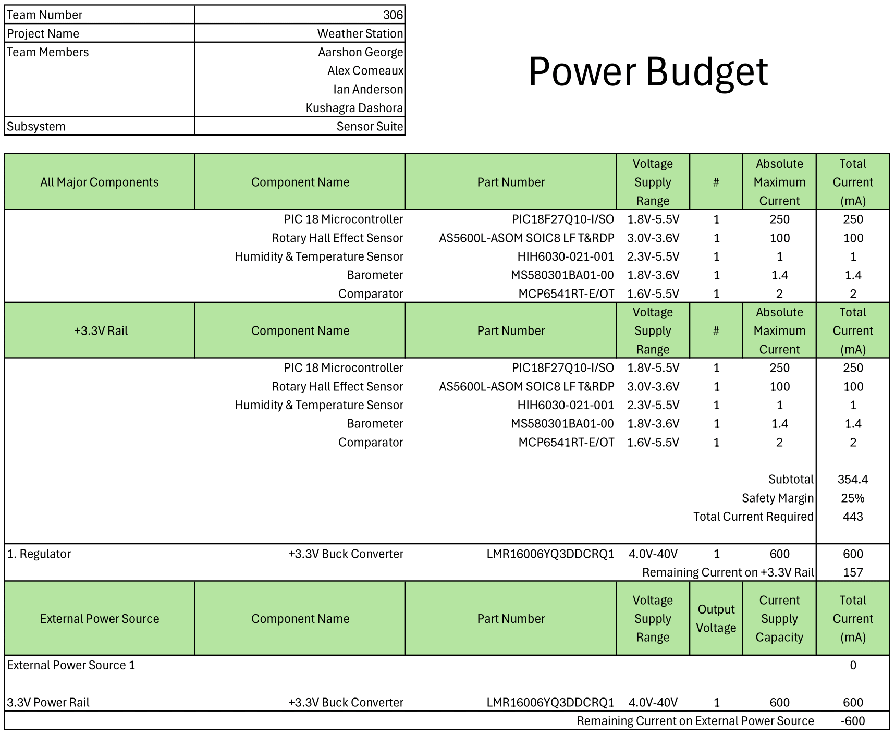

  
[Download](./assets/pdf/power_budget.pdf)

The above Power Budget was used to help determine the necessary aperage capacity for the subsystem. This found that the previously selected voltage regulator, which supplied up to 2 amperes, was complete overkill for the 443 milliamperes that was required. A lower capacity voltage regulator was selected instead to reduce the overhead. This calculation also allowed for verification of good safety overhead margins in the power supply of the subsystem.
