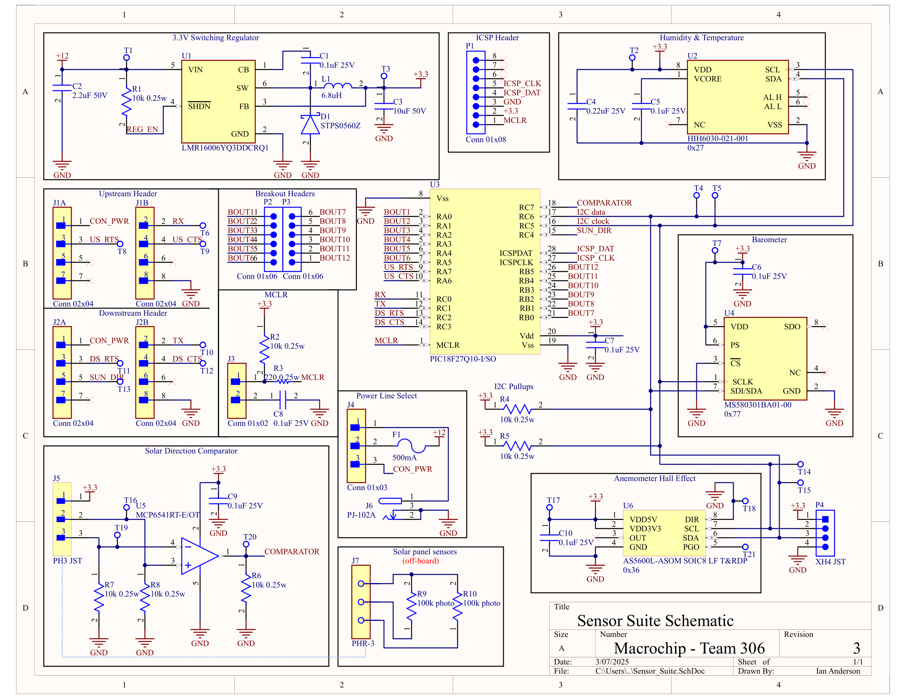

## Schematic

  
[Download Schematic](./assets/pdf/schematic.pdf)

The microcontroller is shown in the center of the schematic. The voltage regulator circuit is shown in top left, with the programming header for the snap programmer to its right. Below those are the daisy chain headers and breakout headers for the remaining IO pins. The photoresistor comparator circuit is depicted in the bottom left. The three sensors are shown on the right side of the schematic and are all connected through the I2C lines to the microcontroller.  
The schematic lacks debugging lights as any debugging can be done through one of the 12 IO pins on the breakout headers.  

Creating this schematic served to plan out and consolidate the circuitry of the PCB with the components. Values of passive components were taken from the recommended circuit depicted in the datasheets; nonetheless, all values were double checked utilizing the provided formulas. The designed subsystem incorporates multiple sensors to gather wind speed, temperature, relative humidity, and air pressure which will be displayed on the device's oled and sent to a web dashboard for remote data monitoring.

## PCB Layout

[Altium Project](./assets/eCAD/EGR314_Ian_Subsytem%20(5-5-2025%2011-53-14).zip)  
[Manufacturing Files](./assets/eCAD/IanAnderson306.zip)  
  

## Improvements Moving Forward

This project exposed many new issues that I had not encountered before while working with embedded systems. I would like to revisit the theory for good component layouts again as I encounter more issues that I believe were due to unseen issues in my routing design. This project also taught me to better understand the scope of what I am capable of as a reduced scope in the variety of application would better allow me to focus on getting the system I have functional. The majority of my pcb circuitry worked as intended upon initial fabrication; however, both the number and variety of sensors that I had selected created difficulties with getting the serial communication fully working. This primarily taught me that careful application of documentation easily allows for a functional design as the majority of difficulties I experienced were software bugs.
