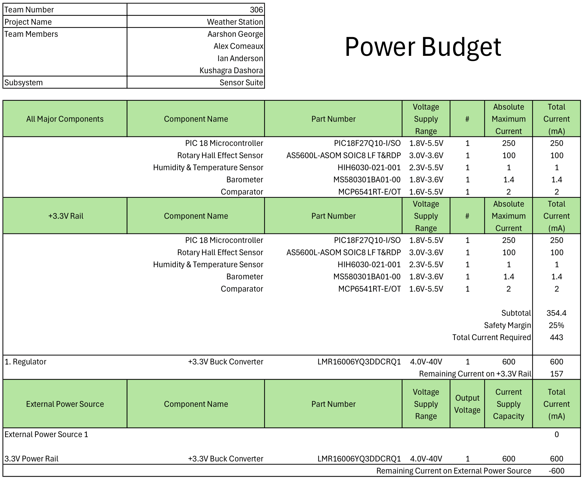

## Sensor Suite

The microcontroller is shown in the center of the schematic. The voltage regulator circuit is shown in top left, with the programming header for the snap programmer to its right. Below those are the daisy chain headers and breakout headers for the remaining IO pins. The photoresistor comparator circuit is depicted in the bottom left. The three sensors are shown on the right side of the schematic and are all connected through the I2C lines to the microcontroller.  
The schematic lacks debugging lights as any debugging can be done through one of the 12 IO pins on the breakout headers.  
[Download Schematic](./assets/source_docs/schematic.pdf)

## Power Budget

The above Power Budget was used to help determine the necessary aperage capacity for the subsystem. This found that the previously selected voltage regulator, which supplied up to 2 amperes, was complete overkill for the 443 milliamperes that was required. A lower capacity voltage regulator was selected instead to reduce the overhead.
